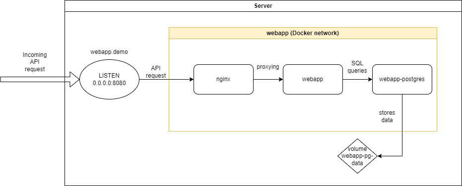

# WEBAPP

## Overview
This is a simple proof-of-concept Python Flask application **webapp** that can be used for monitoring the statuses of other applications. webapp is set up with Docker compose and it exposes an API that can be used for communicating with the webapp. This API can be used for obtaining or updating the status of some application via HTTP requests. These requests can be done manually, but it is also possible to use webapp API as a webhook for some other platform. For example, it can be used as a contact point for Grafana alerts.

The webapp setup consists of three Docker containers running in webapp Docker network. Here is a very simple diagram of the architecture:

In total, there are three services in the webapp Docker compose setup:

- **nginx**

    nginx is used as a proxy that forwards HTTP requests to the webapp. Using nginx in front of webapp helps to keep the webapp Flask application logic simpler as more complex web server configuration can be handled by nginx.

- **webapp**

    webapp is the Python Flask application that handles the API logic. webapp executes various SQL queries based on the incoming HTTP API requests to insert or display information about some application's health. webapp uses PostgreSQL as its database.

- **webapp-postgres**

    webapp-postgres provides PostgreSQL database service to webapp. In the proof-of-concept version described in this README, webapp-postgres database consists of one table **monitoring** that has three columns:
    - id ---> serial
    - appname (**primary key**) ---> varchar(255)
    - status ---> varchar(7) 

  