# WEBAPP
- [WEBAPP](#webapp)
  - [Overview](#overview)
  - [Installation](#installation)
    - [Installation via Ansible](#installation-via-ansible)
      - [Prerequisites](#prerequisites)
      - [Preparations](#preparations)
      - [Running the playbook](#running-the-playbook)
    - [Manual installation](#manual-installation)
  - [API guide](#api-guide)
    - [Root endpoint](#root-endpoint)
    - [Adding a new application to webapp's database](#adding-a-new-application-to-webapps-database)
    - [List all items in webapp's database](#list-all-items-in-webapps-database)
    - [List details about a specific item in webapp's database](#list-details-about-a-specific-item-in-webapps-database)
    - [Get status of a specific item in webapp's database](#get-status-of-a-specific-item-in-webapps-database)
    - [Update the status of a specific item in webapp's database](#update-the-status-of-a-specific-item-in-webapps-database)
    - [Deleting an item from webapp's database](#deleting-an-item-from-webapps-database)
  - [Testing webapp locally with demo resources](#testing-webapp-locally-with-demo-resources)
    - [Overview of demo resources](#overview-of-demo-resources)
    - [Installing demo resources via Ansible](#installing-demo-resources-via-ansible)
      - [Prerequisites](#prerequisites-1)
      - [Preparations](#preparations-1)
      - [Running the playbook](#running-the-playbook-1)
    - [Testing webapp with demo resources](#testing-webapp-with-demo-resources)

## Overview
This is a simple proof-of-concept Python Flask application **webapp** that can be used for monitoring the statuses of other applications. webapp is set up with Docker compose and it exposes an API that can be used for communicating with the application. This API can be used for obtaining or updating the status of some application via HTTP requests. These requests can be done manually, but it is also possible to use webapp API as a webhook for some other platform. For example, it can be used as a contact point for Grafana alerts.

The webapp setup consists of three Docker containers running in webapp Docker network. Here is a very simple diagram of the architecture:

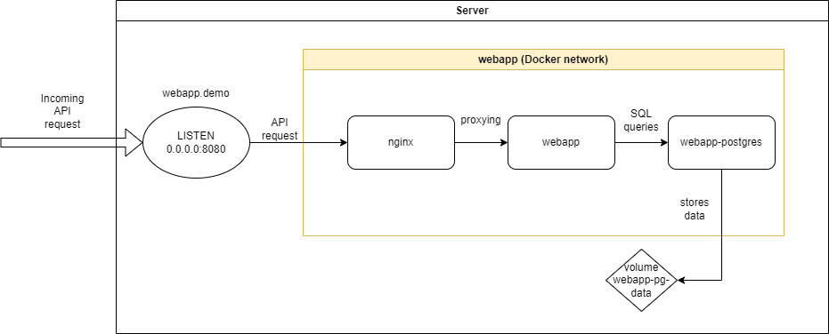

In total, there are three services in webapp's Docker compose setup:

- **nginx**

    nginx is used as a proxy that forwards HTTP requests to webapp. Using nginx in front of webapp helps to keep Flask logic simpler as more complex web server configuration can be handled by nginx. nginx is the only container that is reachable from outside of the webapp Docker network as it is bound to the configured host port. Communication with other services is contained within webapp Docker network.
- **webapp**

    webapp is a Python Flask application that handles the API logic. webapp executes various SQL queries based on the incoming HTTP API requests to insert or display information about some application's health. webapp uses PostgreSQL as its database.

- **webapp-postgres**

    webapp-postgres provides PostgreSQL database service to webapp. In the proof-of-concept version described in this README, webapp-postgres database consists of one table **monitoring** that has three columns:
    - id ---> serial
    - appname (**primary key**) ---> varchar(255)
    - status ---> varchar(7) 

## Installation
This repository contains two options that can be used for installing webapp:

### Installation via Ansible
Ansible playbook **webapp.yaml** can be used for automatically setting up webapp locally, all necessary files can be found from directory **ansible**.  

#### Prerequisites
Installing webapp via Ansible has some prerequisites that need to be met for the playbook run to be successful:

- Hosts defined in **webapp** host group must have docker and docker compose installed. The prepared **./ansible/hosts** file is using localhost as the target.
- Hosts defined in **webapp** host group must have pip3 installed
- The host that is used for running the playbook must have **community.docker** version 3.7.0 ansible collection installed. This is needed for Docker compose V2 Ansible module. The ansible package installation often comes with an older version of **community.docker** collection, but the version can be upgraded with command 
    ```
    ansible-galaxy collection install community.docker --upgrade
    ```
- The configured user for **webapp** hosts must have necessary permissions for executing docker commands. If no user is explicitly defined for **webapp** hosts, then Ansible will use the user that is executing the playbook by default.

#### Preparations
Before the playbook can be executed, following preparations need to be done:

- The prepared variable files in **./ansible/group_vars** are using Ansible Vault for storing sensitive data. If you also wish to use Ansible Vault, create Vault password file **~/.ansible/vault_password** (defined in **./ansible/ansible.cfg**). Local testing can be done without encrypted secrets as well, so feel free to skip the encryption part and define plaintext values for the variables described in the next step.
- Generate encrypted values for variables **localhost_become_password** (this is the password for localhost user running the playbook, needed for executing some tasks with elevated privileges), **webapp_pg_user** (this username will be used for creating a database user for webapp) and **webapp_pg_secret** (password for webapp database user) with command:
    ```
    ansible-vault --vault-password-file ~/.ansible/vault_password encrypt_string '<string_to_encrypt>' --name '<string_name_of_variable>' 
    ```
    **localhost_become_password** should be added to **/ansible/group_vars/all.yaml** file, other two variables should be added to **./ansible/group_vars/webapp.yaml**.
- Define value for variable **webapp_user** (location **./ansible/group_vars/webapp.yaml**). This user will be configured as the owner of files related to webapp.
#### Running the playbook
If the preparations have been done, then it is possible to run the playbook: 
```
   ansible-playbook webapp.yaml
```

Here is a little summary about what the playbook will do:

1. First play just gathers information about the hosts (the provided Ansible setup only uses localhost)
2. Second play will prepare and start up webapp:
   1. By default, all files related to webapp will be added to **/var/lib/webapp**. This location can be overridden by defining some other location with variable **webapp_root_dir** in **./ansible/group_vars/webapp.yaml**
   2. By default, Ansible will build webapp Docker image locally and will use the locally built image in the Docker compose file. This task can be skipped by setting variable **do_build** to false in **./ansible/group_vars/webapp.yaml**
   3. By default, Ansible will use Docker image name **webapp** and tag **v1.0**. These can be changed by defining variables **webapp_image_name** and **webapp_image_version** in **./ansible/group_vars/webapp.yaml**. 
   4. By default, webapp will be exposed to the public with domain name **webapp.demo**. This domain name can be changed by defining variable **webapp_domain** in **./ansible/group_vars/webapp.yaml**
   5. By default, nginx will bind to host port 8080. This can be changed by defining variable **webapp_host_port** in **./ansible/group_vars/webapp.yaml**.
   6. The prepared Ansible setup is meant for starting up the proof-of-concept version of webapp locally. Therefore it is assumed that system-wide DNS hasn't been set up for webapp domain and a corresponding entry to /etc/hosts file will be added to resolve the webapp domain name. This task can be skipped by setting variable **local_testing** to false in **./ansible/group_vars/webapp.yaml**
3. Third play is optional and is disabled by default. If it is enabled, then the third play will prepare and start up resources that can be used for testing webapp. More details about these demo resources and testing webapp can be found below.

When the playbook has finished, then it should be possible to access webapp via URLs http://localhost:HOSTPORT (http://localhost:8080 by default) and http://WEBAPPDOMAIN:HOSTPORT (http://webapp.demo:8080 by default). Following message and web page should be shown, if webapp is up and running: 
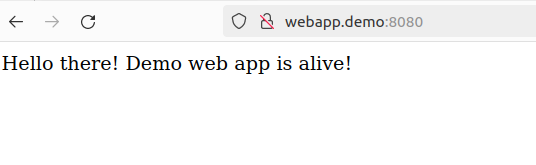

Check the API guide below to see how to communicate with webapp.

### Manual installation
Another option for installing webapp is deploying it manually. All necessary files can be found from directory **manual-deploy**. Following steps need to be done to perform manual installation of webapp:
- Copy the manual-deploy directory to a suitable destination 
- Configure database user for webapp by changing the username in file **./manual-deploy/config/pg_user**. This file will be used to create Docker secret **pg-user** that webapp and webapp-postgres services are using.  
- Configure database password for webapp by changing the password in file **./manual-deploy/config/pg_secret**. This file will be used to create Docker secret **pg-secret** that webapp and webapp-postgres services are using.
- Start up the Docker compose setup in detached mode while being in the directory:
```
   docker compose up -d
```
The Docker compose file will build webapp image based on the provided Dockerfile and will start up all services. After docker compose command has finished, webapp should be accessible via URL http://localhost:8080 and display following message:

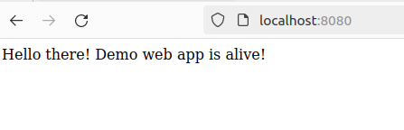

If you wish to test accessing webapp via the domain name defined in nginx configuration, add a corresponding entry to /etc/hosts file (should refer to IPv4 address of the local machine). By default, domain **webapp.demo** will be used, making the webapp accessible via URL http://webapp.demo:8080. If you wish to change webapp's domain, change the default **server_name** parameter in **./manual-deploy/config/webapp-nginx.conf** to the preferred value.
Check the API guide below to see how to communicate with webapp.

## API guide
In total, webapp exposes seven API endpoints:
### Root endpoint
Root endpoint displays a greeting message if webapp is up and accessible.
```
 http://<webapp_domain>:<webapp_host_port>
```
Sending a HTTP request to root endpoint via CLI:
```
teele@sk-demo:~$ curl http://webapp.demo:8080
Hello there! Demo web app is alive! 
```
Accessing root endpoint via browser:


### Adding a new application to webapp's database
Following webapp API endpoint can be used for adding a new application to webapp's database via HTTP POST request:
```
http://<webapp_domain>:<webapp_port>/insert-item
```
The API endpoint is expecting a HTTP POST request with json body that contains key **appname**. The value of key **appname** will be used to insert a new item to webapp's database table. Keep in mind that webapp database uses **appname** column as the primary key, meaning that no duplicates are allowed. Example payload:
```
{"appname": "testikene"}
```

If the POST request is successful, then webapp will respond with a success message (e.g. adding new item **testikene** to webapp's database):
```
teele@sk-demo:~$ curl -X POST http://webapp.demo:8080/insert-item -H 'Content-Type: application/json' -d '{"appname": "testikene"}'
Successfully added new application testikene to monitoring table! 
```
If the POST request fails, then webapp will respond with a general failure message:
```
teele@sk-demo:~$ curl -X POST http://webapp.demo:8080/insert-item -H 'Content-Type: application/json' -d '{"appname": "testikene"}'
Encountered an error while adding new application testikene to monitoring table 
```
webapp container logs can be checked to see what went wrong:
```
[2024-02-04 08:54:47,140] INFO in webapp: Received a POST request for adding a new item to the monitoring table with following data: {"appname": "testikene"}
[2024-02-04 08:54:47,143] ERROR in webapp: Encountered an error while inserting the new item: 
[2024-02-04 08:54:47,144] ERROR in webapp: duplicate key value violates unique constraint "monitoring_pkey"
DETAIL:  Key (appname)=(testikene) already exists.
[2024-02-04 08:54:47,144] ERROR in webapp: Encountered an error while adding new application testikene to monitoring table
```
### List all items in webapp's database
Following API endpoint can be used for listing all items that exist in webapp's database:
```
http://<webapp_domain>:<webapp_port>/list-items
```
Listing items via CLI:
```
teele@sk-demo:~$ curl http://webapp.demo:8080/list-items
[{"ID":"1","appname":"nginx","status":"OK"},{"ID":"2","appname":"testikene","status":"OK"},{"ID":"4","appname":"anotheritem","status":"OK"}]
```
Listing items via browser:

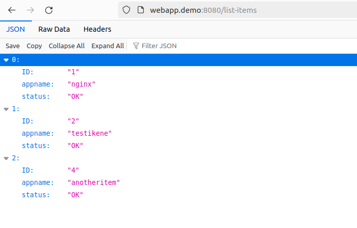
### List details about a specific item in webapp's database
Following API endpoint can be used for listing details about a specific item in webapp's database:
```
http://<webapp_domain>:<webapp_port>/list-item/<appname>
```
Listing details about app **testikene** via CLI:
```
teele@sk-demo:~/repo/demo-webapp$ curl http://webapp.demo:8080/list-item/testikene
{"ID":"2","appname":"testikene","status":"OK"}
```
Listing details about app **testikene** via browser:

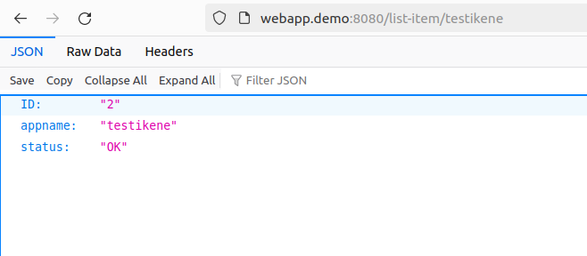
### Get status of a specific item in webapp's database
Following API endpoint can be used for requesting status of the specified item:
```
http://<webapp_domain>:<webapp_port>/get-status/<appname>
```
Requesting the status of application **testikene** via CLI:
```
teele@sk-demo:~/repo/demo-webapp$ curl http://webapp.demo:8080/get-status/testikene
{"status":"OK"}
```
Requesting the status of application **testikene** via browser:

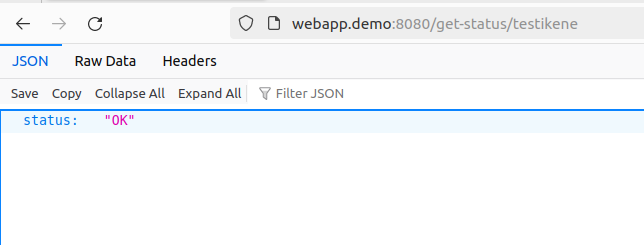

### Update the status of a specific item in webapp's database
Following API endpoint can be used for updating the value of column **status** for the specified item in webapp's database via HTTP POST request:
```
http://<webapp_domain>:<webapp_port>/update-status
```
The logic of status updating was written to be compatible with Grafana alerting via webhook (more details about Grafana alert json body structure can be found from https://prometheus.io/docs/alerting/latest/configuration/#webhook_config). This means that HTTP POST requests sent to this endpoint should follow some rules:
  - json body should contain key **alerts** which is a list of dictionaries
  - dictionaries in **alerts** list should contain following keys:
    -  **status** (string) ---> to change the item status in database to PROBLEM, set the value of **status** key to "firing". To change the item status in database to OK, set the value of **status** key to "resolved". If some other value is specified, then API will skip this item.
    - **labels** (dictionary) ---> **labels** value needs to be a dictionary that contains key **appname**. Value of **appname** key should match with the application's name in webapp's database as this value is used during the SQL UPDATE query for identifying the correct application.
- example payload for changing the status of application **testikene** to PROBLEM:
  ```
   {"alerts": [{"status": "firing", "labels": {"appname": "testikene"}}]}
  ``` 
API will respond with a list of dictionaries to let the user know if the updates to specified applications were successful.

Sending a HTTP POST request via CLI to change status of **testikene** to PROBLEM:
```
teele@sk-demo:~/repo/demo-webapp/ansible$ curl -X POST http://webapp.demo:8080/update-status -H 'Content-Type: application/json' -d '{"alerts": [{"status": "firing", "labels": {"appname": "testikene"}}]}'
[{"appname":"testikene","update":"success"}]   
``` 
Checking the status of **testikene** after updating its status:
```
teele@sk-demo:~/repo/demo-webapp/ansible$ curl http://webapp.demo:8080/get-status/testikene
{"status":"PROBLEM"} 
``` 
Changing the status of **testikene** back to OK and checking the results:
```
teele@sk-demo:~/repo/demo-webapp/ansible$ curl -X POST http://webapp.demo:8080/update-status -H 'Content-Type: application/json' -d '{"alerts": [{"status": "resolved", "labels": {"appname": "testikene"}}]}'
[{"appname":"testikene","update":"success"}]
teele@sk-demo:~/repo/demo-webapp/ansible$ curl http://webapp.demo:8080/get-status/testikene
{"status":"OK"}
``` 
### Deleting an item from webapp's database
Following API endpoint can be used for removing an item from webapp's database via HTTP POST request:
```
http://<webapp_domain>:<webapp_port>/delete-item
```
The API endpoint is expecting a HTTP POST request with json body that contains key **appname**. Value of key **appname** will be used in SQL DELETE query. Example payload:
```
{"appname": "testikene"}
```
Removing item **testikene** from webapp's database via CLI:
```
teele@sk-demo:~/repo/demo-webapp/ansible$ curl -X POST http://webapp.demo:8080/delete-item -H 'Content-Type: application/json' -d '{"appname": "testikene"}'
Successfully removed application testikene from webapp database!
```
## Testing webapp locally with demo resources
This repository also provides demo resources that can be used for locally testing webapp. These demo resources can be deployed with Ansible.

### Overview of demo resources
The demo resources are deployed with Docker compose file which starts up following services:
- **prometheus**
 
  prometheus service will be used as the datasource for grafana, it will be exposing metrics of demo_nginx service.
- **grafana**

  grafana service will bind to host port 3000 and will be accessible via url http://localhost:3000. Docker compose will automatically provision the alert rule, the webapp contact point and the notification policy that can be used for testing webapp with Grafana.
- **demo_nginx**
  
  demo_nginx will be started up as a dummy service for quick testing, it won't be actually serving any application.
- **nginx_exporter**
  
  nginx-exporter service will be forwarding demo_nginx metrics to prometheus service.
### Installing demo resources via Ansible
Demo resources can be automatically started up and prepared for quick testing via Ansible.
#### Prerequisites
 Installing demo resources via Ansible has some prerequisites that need to be met for the playbook run to be successful:
- Hosts defined in **demo** host group must have docker and docker compose installed. The prepared **./ansible/hosts** file is using localhost as the target.
- Hosts defined in **demo** host group must have pip3 installed
- The host that is used for running the playbook must have **community.docker** version 3.7.0 ansible collection installed. This is needed for Docker compose V2 Ansible module. The ansible package installation often comes with an older version of **community.docker** collection, but the version can be upgraded with command 
    ```
    ansible-galaxy collection install community.docker --upgrade
    ```
- The configured user for **demo** hosts must have necessary permissions for executing docker commands. If no user is explicitly defined for **demo** hosts, then Ansible will use the user that is executing the playbook by default.
#### Preparations
Before the playbook can be executed, following preparations need to be done:
  - Set the value of variable **want_demo** to true in **./ansible/group_vars/all.yaml**
  - Define value for variable **demo_user** (location **./ansible/group_vars/demo.yaml**). This user will be configured as the owner of files related to demo resources
  - If you did **NOT** use default values for webapp's domain (default webapp.demo) and host port (default 8080), then specify the correct values with variables **webapp_domain** and **webapp_host_port** in file **./ansible/group_vars/demo.yaml** or **./ansible/group_vars/all.yaml**.
  If default values for webapp were used, then it is not necessary to define these variables.
#### Running the playbook
If the preparations have been done, then the demo resources can be deployed by running **webapp.yaml** playbook. If you wish to skip the webapp play, then use parameter **-t demo** when running the playbook:
```
ansible-playbook webapp.yaml -t demo 
```
Demo resources are created and started up by the third play in **webapp.yaml** playbook. All files related to demo components will be copied to **/var/lib/demo** by default. This location can be changes by defining the preferred destination with variable **demo_root_dir**.

### Testing webapp with demo resources
When the playbook run has finished, Grafana UI should be accessible via URL http://localhost:3000. It is possible to log in to Grafana with built-in user **admin** and its default password **admin**. Ansible has already prepared Prometheus datasource (using prometheus service from compose), webhook contact point that refers to webapp's status update endpoint, an alert rule that goes into problem state when demo_nginx isn't running and a notification policy that binds the demo_nginx alert rule to the webapp contact point. 

The pre-made demo_nginx alert rule has label **appname** configured, this label needs to be added to all Grafana alert rules that need to use webapp's webhook as their contact point as webapp uses it to determine which application's status should be updated. 
The demo_nginx alert rule's status should be in normal state after the demo services have started up:

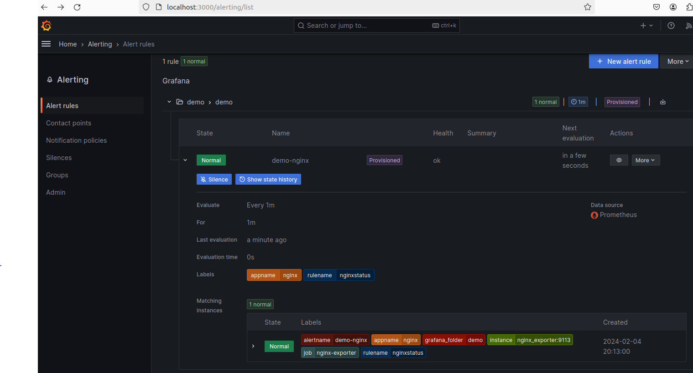

Ansible also ensures that **nginx** item exists in webapp's database:

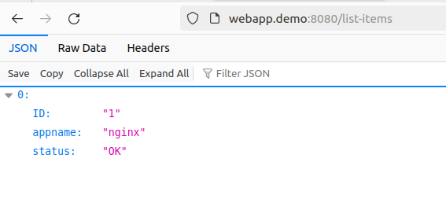

To test Grafana and webapp intergation, stop demo_nginx container:
```
docker stop demo_nginx
```
This will cause demo_nginx alert rule to switch to firing state in a minute or two (evaluation frequency has been set to 1 minute).

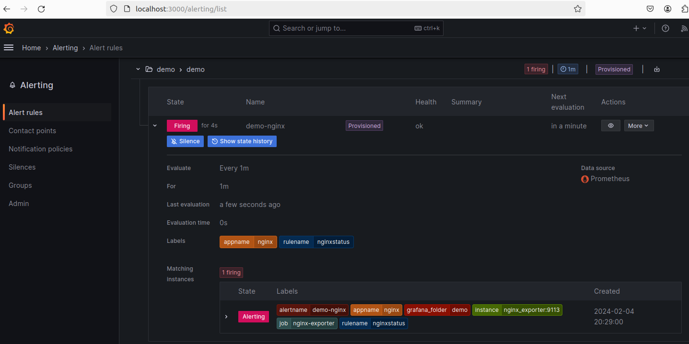

Keep an eye on webapp's contact point. After demo_nginx alert has gone into firing state, Grafana should soon send out the notification which will be visible under webapp's contact point (Last delivery attempt). It may take a few minutes. If no message about failed delivery is displayed under webapp's contact point, then it means that the attempt was successful.

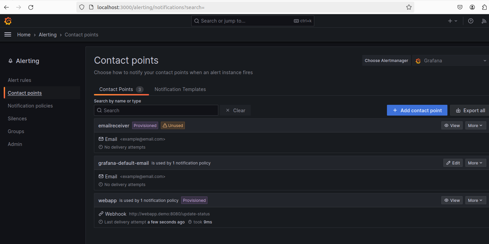

After Grafana shows that the alert has been sent out, it can be seen that webapp also displays that nginx's status is in **PROBLEM** state:

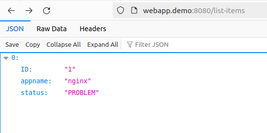

To test changing the status back to normal via Grafana, start demo_nginx container:
```
docker start demo_nginx
```
The status of demo_nginx alert will return to normal after a minute or two and webapp's contact point will be triggered shortly after. webapp should now display "OK" status for nginx.

Traces of Grafana and webapp communication can also be seen from webapp's logs:
```
teele@sk-demo:~/repo/demo-webapp/ansible$ docker logs -n 4 webapp
[2024-02-04 18:29:30,027] INFO in webapp: Received status update for app nginx, changing status to PROBLEM
[2024-02-04 18:29:30,031] INFO in webapp: Successfully changed status to PROBLEM for app nginx
[2024-02-04 18:36:30,032] INFO in webapp: Received status update for app nginx, changing status to OK
[2024-02-04 18:36:30,035] INFO in webapp: Successfully changed status to OK for app nginx
```
